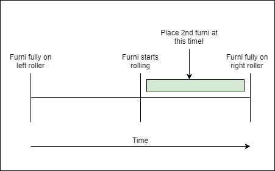
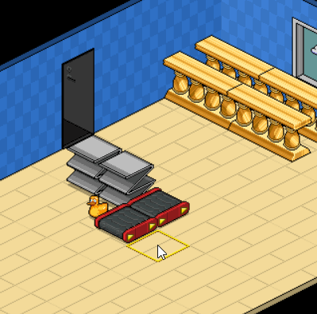

<b> Join the [:fontawesome-brands-discord:{ .discord } Habbo Archive discord! ](https://discord.gg/5u2VDQM2eV) </b>

# Stacking in Habbo: Origins

Stacking in Habbo Origins is slightly different than stacking in the classic Habbo from 2005.
Some custom code was added to make stacking 1-tile furni easier, and for stacking 2+ size furni, 
the use of a bug is required. This bug in unique to Habbo: Origins.

### 1. Stacking 1-tile furni at same height

{ align=right width=300 }
Stacking 1-tile size furni at the same height is fairly simple; you just have to get the hang of the timing.

Point two rollers at eachother. Place one furni on the roller. As soon as the first furni starts to move to the next roller,
place the second furni where the first furni is going.

You can add stack multiple furni in this way; just keep placing the next furni as soon as the
existing stack starts moving.

{ width=50% }

### 2. Stacking 1-file furni at 2 heights at multiple heights
{ align=right width=300 }
For stacking multiple heights, purchase some Z-tables. Z-tables are about half the height of a mode bar,
or 1/3 the height of a Lodge corner plinth.

Like before, point two rollers at eachother. Instead of placing down a furni on the roller, place Z-tables to your
preferred height. I will be stacking two Lodge corner plinths, so I will use the height of 3 Z-tables.

After setting up your preferred height, make sure there is only one Z-table left on the roller.
place the furni on top of the z-table, then remove the z-table.
Afterwards, use the technique in [chapter 1](#1-stacking-1-tile-furni-at-same-height) to merge the bottom and top furni.

!!! bug
    Due to a bug in Habbo: Origins, if you try to place 3 Z-tables on top of eachother,
    the 3rd Z-table will 'merge' with the 2nd. To prevent this, always only use 2 z-tables.
    Move the bottom one away, then place it on top of the remaining Z-table.

### 3. Stacking 1-tile furni at multiple heights
!!! tip
    Stacking multiple heights is a bit tricky. Using 4 rollers in a circle will make it easier.

{ align=right width=300 }

For this part, I'll show you how to stack 3 Lodge corner plinths. However, you can use this technique to stack
more than 3 lodge corner plinths, and even stack different furni on multiple heights. You see this used a lot in arcade rooms.

First, stack up 2 furni as instructed in [chapter 2](#2-stacking-1-file-furni-at-2-heights). Then, just before the
2-high stack you built starts moving to the next roller, place a Z-table where the stack is going to move.
This will cause the existing stack to move up one Z-table height.
Do this three more times, and then place the bottom furni with the timing from [chapter 1](#1-stacking-1-tile-furni-at-same-height).

Be aware that the timing to move a stack on top of the Z-table has a different timing than normal stacking!
It's a bit tricky at first, but with enough practice you'll get the hang of it.
<figure markdown="1">
{ width=100%  }
</figure>
### 4. Stacking 2-tile furni

!!! warning
    Stacking 2+ size furni is only possible due to a bug in Habbo Origin's code.
    This might get patched out later.
    
    A limitation of this method is that the bottom-most furni will always be at least 1 Z-table high.

In the old Habbo, stacking 2+ size furniture was done by using Trax or Coin furni. However, currently, Habbo Origins
does not have those. 

Instead, we'll use a bug introduced in Habbo Origins. 
I'll show you how to use it first,
and write my theory as to why this works below that.

I'll be using Lodge Room Dividers as an example, but any furni works. Lodge bars are 2 Z-tables high.

{ align=right width=300 }

1. Instead of making the rollers point towards eachother, make them point in one direction.

2. Place Z-tables in the shape of the furni you want to stack.

3. Block the roller and stack Z-tables to the desired height of the 2nd furni. In my example, 2 Z-tables high.

4. Make the rollers point towards one of the Z-tables. They will automatically merge.
5. Block the roller and stack Z-tables to the desired height of the 3rd furni. In my example, 4 Z-tables high.
6. Repeat this process until you reach the desired height for the finished furni stack.

7. lace the bottom-most furni on the Z-table shape you created. Remove the bottom-most Z-table.
8. Place the next furni and remove the new bottom-most Z-table.
9. Repeat this process until all furni are placed and all Z-tables are removed.
10. Remove all the Z-tables at the ground level.

#### Why does this work?
<i> TL;DR at the bottom. </i>

Currently, there exists a bug in Habbo Origins where stackable items clip into eachother.
For example:

{ align=right width=300 }

* You place down a table with a TV. You then place a plant on that same table tile. The TV and plant are now merged.

* You place two Z-tables on top of eachother. You place another one. The two top-most Z-tables are now merged.

* You place a Z-table. You place a Lodge Room Divider on top of it. You place another Lodge Room Divider on top of it. The game shouldn't have allowed you to do this, but has done it anyway. No rollers required.

#### My theory

I have no insights into the Habbo Origins code. However, I discovered multi-width furni stacking by trying to figure out what was causing this bug.

My theory is this:

When a furni is placed into a tile, the tile should determine:

* Is this new furni positioned higher than other furni? If so, register it as the highest

* If the new furni is the highest, can new items be placed on top of the furni?

* If so, tell the tile that it can accept a new item placement, and place it above the current highest furni.

However, somehow that is not what happends.
As far as I can tell, furni within a tile are placed in a sort of "queue", sorted based on who entered the tile first. 
Furni are only removed from this queue when they are removed from the tile.

When checking whether a new furni can be placed, the tile checks the oldest item placed in the queue. If the oldest item can be stacked upon, simply stack the new furni on top. It does not check whether the space above the oldest item is already occupied, which allows for merging items (e.g. lodge dividers).

{ align=right width=300 }

The stacking technique in [chapter 4](#4-stacking-2-tile-furni) works because each time a Z-table is added, it gets appended to the queue.
The user then removes the bottom-most Z-table, removing it from the queue. When placing a new item, the tile then checks whether the 2nd-oldest-item, now at the top of the queue, is stackable- which it is.

If the 2nd item to enter the tile was a Lodge Divider, and a 3rd item a Z-table, this stacking would not work; the Lodge Divider would be the 'oldest item' in the queue, and cannot be stacked upon. I've demonstrated this in a gif.

!!! quote "TL:DR" 
    Tiles should keep track of the topmost tile. Instead of this being one furni, it is an array sorted from old to new. Only the oldest furni gets checked if items can be stacked on top of it, allowing for merging of furni. 

